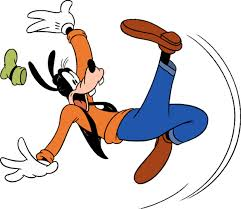
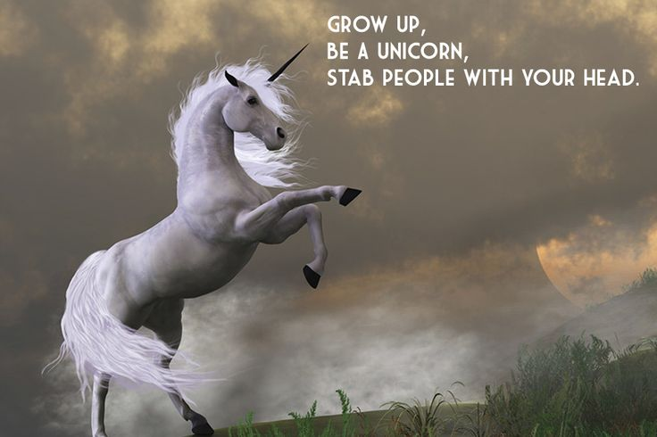
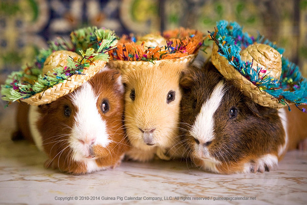
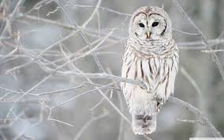
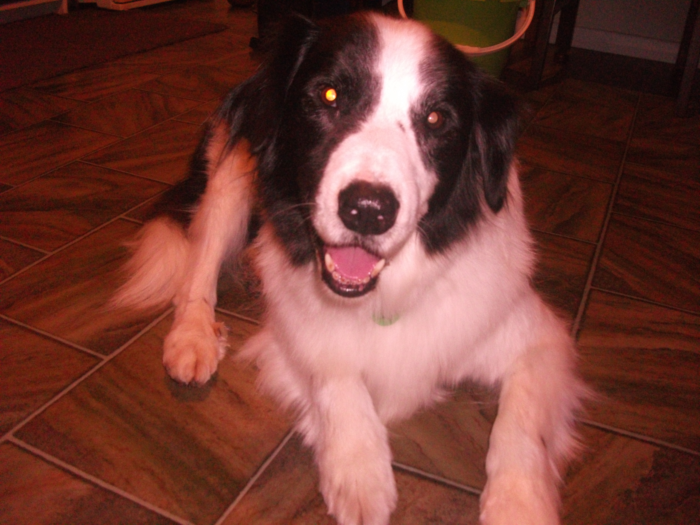

# Animal Party!

Once upon a time in Motueka, some humans threw a party for animals. First to arrive was Merrin's cat, Jack, who she brought from Wellington. He found someone to cuddle him.

Next to arrive was Chico, the cutest, cuddliest canine ever - Tania's smoochey shih tzu "moko-puppy" (Mokopuna is the Maori term for grandchild).

Goofy arrived at the party, really keen to see everyone.  He sauntered towards his friends and unfortunately tripped over his feed and landed on his nose.  Phlamb!!  Ouch!!!  "oh golly gosh" he said.  He picked himself up and continued on across the room.

#Goofy

Joy the Unicorn popped in for a visit. She started off the day full of enthusiasm and feeling like she could take on the world. By 3pm she wasn't quite floating on air like before....

She then wondered if her attempt at inserting an image worked. Joy the Unicorn is getting a headache now :-)

How I feel about github

Woop woop love partys and animals. I need Gin.

![serpent]
(http://www.wow-petopia.com/images/skin_pix/serpentskinwhite.jpg)

Animal Party is happening today
Jerry the Rabbit is coming to stay
He hopes there'll be bunnies, he wants to play
He hopes his friend is coming this way
Because the animal party is happening today

Tenzing the Yak climbed to get the famed mountain chocolate from the Buddhist monks at the top of the Himalayan Ranges.
When the monks found that he was bringing the special chocolate to the Rails Girls in Motueka, they packed his bags fully!

The camel made a nice cream cake to take to the party.she made sure she was wearing her best dress and hat.When she arrived she handed the cake in and talked to all her friends who were there.

![] (https://www.youtube.com/watch?v=Jn_5RjLiGHY&noredirect=1)
On seeing one another and the splendid celebration, the animals broke out in a harmonious chorus

once upon a time,
a unicorn got a letter inviting her to a party from her sister on the back of the invition was:

when Rebecca the unicorn got to the party she saw cake and went running towards it.
she got faster and faster.
As she got closer she could not stop and fell into the cake.
The cake exploded into crumbs and went everywhere.

Then the door burst open and 20 dogs pulling a unicorn on a sleigh came trought the door.
the snow witch came next then she froze the whole party

# Check out the groovy guinea pigs at the animal party!

once apon a time there was an owl that flapped her wings about and grooved on the dance floor at the animal party

zebra unicorns are AWESOME!!!!!!!!!!!!!!!!!!!!!!!!!!!!!!!!

 Ewok he is coming to the party he is bringing his cloak with his bow and arrow. He is from star wars!
He is very excited here is a photo! yay!

Heather the hula hooping hippo was stoked to be on the invite list to the animal party. Watch out for her in her purple tutu.

Watch out! Even though we are not inviting the poisonous dart frog

Rohellio the Alpaca
