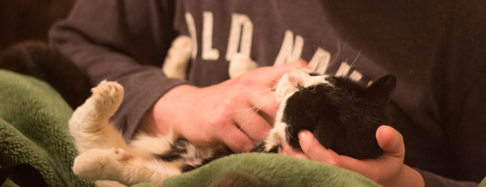

Animal Party!

Once upon a time in Motueka, some humans threw a party for animals. First to arrive was Merrin's cat, Jack, who she brought from Wellington. He found someone to cuddle him.

Joy the Unicorn popped in for a visit. She started off the day full of enthusiasm and feeling like she could take on the world. By 3pm she wasn't quite floating on air like before....

How I feel about github
